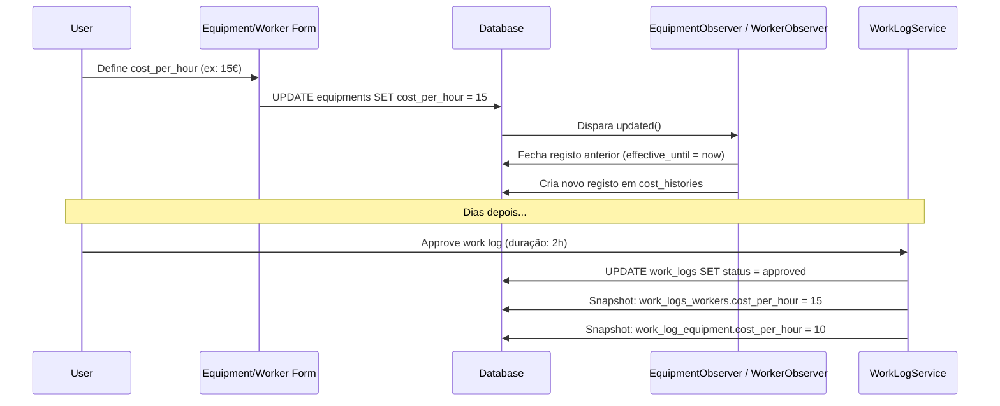

# PRD — Sistema de Custo por Hora

**Product Requirements Document**

| Campo | Valor |
|-------|-------|
| **Data** | 2026-05-12 |
| **Versão** | 1.0 |
| **Status** | Aprovado |
| **Prioridade** | Alta |

---

## 1. Objetivo

Adicionar um campo `cost_per_hour` (custo por hora) às entidades **Equipment** e **Worker** do sistema, permitindo o cálculo automático do custo de mão-de-obra e equipamentos associados a registos de trabalho (`WorkLog`), bem como o histórico de alterações desses custos ao longo do tempo.

---

## 2. Problema

Atualmente o sistema regista `duration_minutes` nos work logs e tem relações com workers, equipments e materiais (estes últimos já com `unit_price_at_use`). No entanto:

1. **Não existe** qualquer campo de custo para workers ou equipments
2. **Não é possível** calcular o custo total de um work log (soma de mão-de-obra + equipamento + material)
3. **Não há histórico** de alterações de preços — se o custo/hora de um trabalhador mudar, perde-se o valor anterior
4. **Não é possível** gerar relatórios de custos por worker, equipment ou período

---

## 3. Escopo

### Incluído

- ✅ Coluna `cost_per_hour` (decimal 10,2, default 0.00) em `equipments` e `workers`
- ✅ Coluna `cost_per_hour` nas tabelas pivot `work_logs_workers` e `work_log_equipment` (snapshot)
- ✅ Tabela `cost_histories` para histórico de alterações (polimórfica, com `effective_from`/`effective_until`)
- ✅ Snapshot automático do custo no momento da aprovação do work log (`approve()`)
- ✅ Registo automático de alterações no histórico via Eloquent Observer
- ✅ Campos nos formulários de criação/edição de Equipment e Worker
- ✅ Exposição do `cost_per_hour` nas APIs (Resources)
- ✅ Traduções EN e PT_PT

### Excluído

- ❌ **Teams** — não terão `cost_per_hour` (fora do âmbito)
- ❌ Cálculo automático de custo total em work logs (será feito numa fase posterior)
- ❌ Relatórios ou dashboards de custos (serão feitos numa fase posterior)
- ❌ Multi-moeda (apenas EUR)

---

## 4. Requisitos Funcionais

### RF01 — Coluna cost_per_hour nas entidades base

| Entidade | Tabela | Tipo | Default | Ação |
|----------|--------|------|---------|------|
| Equipment | `equipments` | `decimal(10,2)` | `0.00` | Migração: `add_cost_per_hour_to_equipments` |
| Worker | `workers` | `decimal(10,2)` | `0.00` | Migração: `add_cost_per_hour_to_workers` |

### RF02 — Coluna cost_per_hour nas tabelas pivot de work logs

| Pivot | Tabela | Tipo | Default | Ação |
|-------|--------|------|---------|------|
| WorkLog-Worker | `work_logs_workers` | `decimal(10,2)` | `0.00` | Migração: `add_cost_per_hour_to_work_logs_workers` |
| WorkLog-Equipment | `work_log_equipment` | `decimal(10,2)` | `0.00` | Migração: `add_cost_per_hour_to_work_log_equipment` |

### RF03 — Snapshot no approve()

- No método [`WorkLogService::approve()`](app/Features/WorkLogs/Services/WorkLogService.php:86), após o update de status:
  1. Carregar as relações `workers` e `equipment` (com `loadMissing`)
  2. Para cada worker, copiar `worker->cost_per_hour` para a pivot `work_logs_workers.cost_per_hour`
  3. Para cada equipment, copiar `equipment->cost_per_hour` para a pivot `work_log_equipment.cost_per_hour`

- O snapshot NÃO é feito no `complete()` — apenas no `approve()`, garantindo que o custo reflete o valor vigente no momento da aprovação.

### RF04 — Tabela de histórico cost_histories

```sql
cost_histories
├── id              UUID PK
├── entity_type     VARCHAR (FQCN da classe, ex: App\Features\Equipments\Models\Equipment)
├── entity_id       UUID (FK polimórfica)
├── cost_per_hour   DECIMAL(10,2)
├── changed_by      UUID FK → users (nullable)
├── effective_from  DATETIME
├── effective_until DATETIME (null = ativo)
└── timestamps
```

**Regras de negócio:**
- Apenas **um** registo por `entity_type` + `entity_id` pode ter `effective_until = null` (o ativo)
- Quando um novo custo é definido, o registo ativo anterior recebe `effective_until = now()` e um novo registo é criado com `effective_from = now()` e `effective_until = null`
- O campo `entity_type` usa o FQCN Laravel (`get_class($model)`) para compatibilidade com `morphs()` nativo

### RF05 — Observers automáticos

| Observer | Modelo | Evento | Ação |
|----------|--------|--------|------|
| [`EquipmentObserver`](app/Features/Equipments/Observers/EquipmentObserver.php) | `Equipment` | `updated` | Se `cost_per_hour` mudou → fechar registo ativo + criar novo na `cost_histories` |
| [`WorkerObserver`](app/Features/Workers/Observers/WorkerObserver.php) | `Worker` | `updated` | Se `cost_per_hour` mudou → fechar registo ativo + criar novo na `cost_histories` |

### RF06 — Formulários

#### EquipmentFormSchema ([`create()`](app/Features/Equipments/EquipmentFormSchema.php:11) e [`update()`](app/Features/Equipments/EquipmentFormSchema.php:64))
- Campo `cost_per_hour` do tipo `NumberInput`
- Label EN: "Cost per Hour (€)" | Label PT: "Custo por Hora (€)"
- Regras: `required|numeric|min:0|max:9999.99`

#### WorkerFormSchema ([`create()`](app/Features/Workers/WorkerFormSchema.php:11) e [`update()`](app/Features/Workers/WorkerFormSchema.php:51))
- Campo `cost_per_hour` do tipo `NumberInput`
- Label EN: "Hourly Rate (€)" | Label PT: "Taxa Horária (€)"
- Regras: `required|numeric|min:0|max:9999.99`

### RF07 — API Resources

| Resource | Campo a adicionar |
|----------|-------------------|
| [`EquipmentResource`](app/Features/Equipments/Resources/EquipmentResource.php) | `'cost_per_hour' => $this->cost_per_hour` |
| [`WorkerResource`](app/Features/Workers/Resources/WorkerResource.php) | `'cost_per_hour' => $this->cost_per_hour` |

### RF08 — Traduções

| Chave | EN | PT_PT |
|-------|----|-------|
| `forms.equipments.cost_per_hour` | "Cost per Hour (€)" | "Custo por Hora (€)" |
| `forms.equipments.cost_per_hour_helper` | "Hourly cost rate for this equipment" | "Custo horário deste equipamento" |
| `forms.workers.cost_per_hour` | "Hourly Rate (€)" | "Taxa Horária (€)" |
| `forms.workers.cost_per_hour_helper` | "Worker's hourly pay rate" | "Taxa horária do trabalhador" |

---

## 5. Fluxo de Dados



---

## 6. Regras de Negócio

| RN | Descrição |
|----|-----------|
| RN01 | `cost_per_hour` é sempre `>= 0` e `<= 9999.99` |
| RN02 | O valor padrão é `0.00` (grátis / sem custo) |
| RN03 | O snapshot é populado **apenas** no `approve()`, não no `complete()` |
| RN04 | Alterações ao `cost_per_hour` são sempre registadas na `cost_histories` com timestamp |
| RN05 | Apenas um registo ativo (`effective_until = null`) por entidade |
| RN06 | Teams não têm `cost_per_hour` |

---

## 7. Stack Técnica

| Componente | Tecnologia |
|------------|------------|
| Backend | Laravel 11 (PHP 8.2+) |
| Database | MySQL / MariaDB |
| ORM | Eloquent (morphs polimórfico) |
| Validação | Form Request + FormSchema |
| UI | Inertia.js + React (formulários) |
| I18n | Ficheiros PHP em `resources/lang/` |

---

## 8. Critérios de Aceitação

1. **CA01** — É possível definir `cost_per_hour` ao criar/editar um Equipment ou Worker
2. **CA02** — O valor `cost_per_hour` é devolvido nas APIs de Equipment e Worker
3. **CA03** — Quando um work log é aprovado, o `cost_per_hour` atual de cada worker/equipment é copiado para a pivot
4. **CA04** — Sempre que o `cost_per_hour` de um worker/equipment é alterado, um novo registo é criado na `cost_histories`
5. **CA05** — É possível consultar qual era o `cost_per_hour` de um worker/equipment numa data específica via `scopeEffectiveAt($date)`
6. **CA06** — Apenas um registo ativo por entidade na `cost_histories`

---

## 9. Marcos (Milestones)

| Marco | Descrição | Esforço |
|-------|-----------|---------|
| M1 | Migrations (5) + Modelos (Equipment, Worker, CostHistory) | 1h |
| M2 | Observers (EquipmentObserver, WorkerObserver) + registo no AppServiceProvider | 30min |
| M3 | Snapshot no WorkLogService::approve() | 30min |
| M4 | Formulários (EquipmentFormSchema, WorkerFormSchema) | 30min |
| M5 | API Resources (EquipmentResource, WorkerResource) | 15min |
| M6 | Traduções (EN + PT_PT) | 15min |
| | **Total estimado** | **~3h** |

---

## 10. Anexos

- Plano detalhado: [`docs/plano_custo_por_hora.md`](docs/plano_custo_por_hora.md)
- Esquema atual de equipments: [`database/migrations/2026_05_04_090000_create_equipments_table.php`](database/migrations/2026_05_04_090000_create_equipments_table.php)
- Esquema atual de workers: [`database/migrations/2024_01_01_000023_create_workers_table.php`](database/migrations/2024_01_01_000023_create_workers_table.php)
- WorkLog model: [`app/Features/WorkLogs/Models/WorkLog.php`](app/Features/WorkLogs/Models/WorkLog.php)
- WorkLog service: [`app/Features/WorkLogs/Services/WorkLogService.php`](app/Features/WorkLogs/Services/WorkLogService.php)
