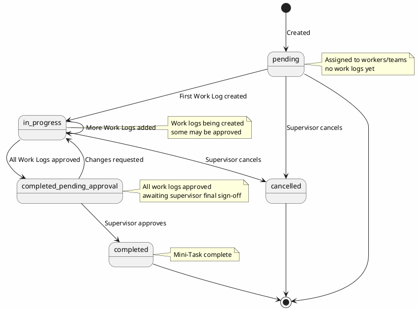
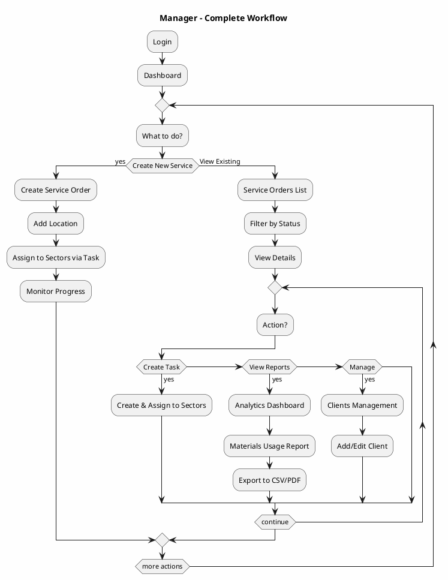
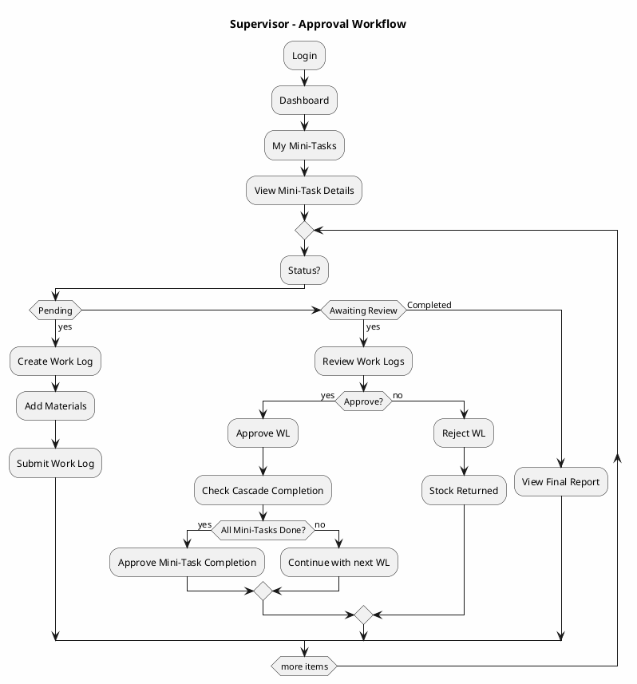
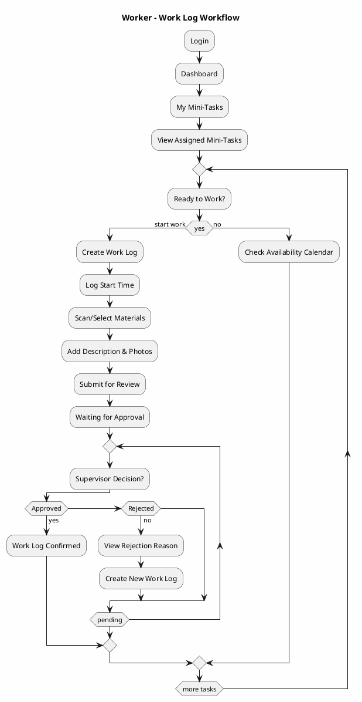
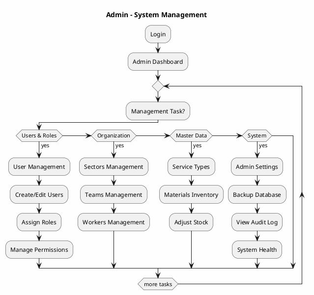

# Site Map & Application States/Flows (PlantUML)

## 📍 Website Hierarchy & Navigation Structure

### 🎯 Main Site Map (Page Hierarchy)

```
📱 Application Root (/)
│
├── 🔐 Authentication (No Login Required)
│   ├── /auth/register
│   ├── /auth/login
│   ├── /auth/forgot-password
│   ├── /auth/reset-password/{token}
│   ├── /auth/verify-email/{code}
│   └── /auth/logout
│
├── 📊 Dashboard (All Authenticated Users)
│   ├── / (home)
│   └── /dashboard
│
├── 👤 User Management (Admin Only)
│   ├── /admin/users
│   │   ├── /admin/users (List)
│   │   ├── /admin/users/create
│   │   └── /admin/users/{id}/edit
│   ├── /admin/profile (Own profile)
│   └── /admin/account-settings
│
├── 🔑 Roles & Permissions (Admin Only)
│   ├── /admin/roles
│   │   ├── /admin/roles (List)
│   │   ├── /admin/roles/create
│   │   ├── /admin/roles/{id}/edit
│   │   ├── /admin/roles/{id}/permissions (Manage permissions)
│   │   └── /admin/roles/{id}/delete
│   └── /admin/permissions (View all available permissions)
│
├── 👥 Clients (Manager, Admin)
│   ├── /clients
│   │   ├── /clients (List/Search)
│   │   ├── /clients/create
│   │   ├── /clients/{id}
│   │   │   ├── /clients/{id}/edit
│   │   │   ├── /clients/{id}/service-orders (Related SO)
│   │   │   ├── /clients/{id}/locations (Registered locations)
│   │   │   └── /clients/{id}/export
│   │   └── /clients/{id}/delete
│   └── /clients/export
│
├── 📋 Service Orders (Manager, Supervisor, Admin)
│   ├── /service-orders
│   │   ├── /service-orders (List/Filter by status)
│   │   ├── /service-orders/create
│   │   ├── /service-orders/{id}
│   │   │   ├── /service-orders/{id}/edit
│   │   │   ├── /service-orders/{id}/tasks (View tasks)
│   │   │   ├── /service-orders/{id}/create-task
│   │   │   ├── /service-orders/{id}/attachments
│   │   │   ├── /service-orders/{id}/timeline (History)
│   │   │   ├── /service-orders/{id}/change-status
│   │   │   ├── /service-orders/{id}/assign-sectors
│   │   │   └── /service-orders/{id}/delete
│   └── /service-orders/export
│
├── ✅ Tasks (Manager, Supervisor, Admin)
│   ├── /tasks
│   │   ├── /tasks (List)
│   │   ├── /tasks/{id}
│   │   │   ├── /tasks/{id}/edit
│   │   │   ├── /tasks/{id}/mini-tasks (View mini-tasks)
│   │   │   ├── /tasks/{id}/create-mini-task
│   │   │   ├── /tasks/{id}/sectors (Assigned sectors)
│   │   │   ├── /tasks/{id}/change-status
│   │   │   ├── /tasks/{id}/attachments
│   │   │   └── /tasks/{id}/timeline
│   └── /tasks/{id}/delete
│
├── 🎯 Mini-Tasks (Supervisor, Worker, Admin)
│   ├── /mini-tasks
│   │   ├── /mini-tasks (List - My assigned)
│   │   ├── /mini-tasks/{id}
│   │   │   ├── /mini-tasks/{id}/edit
│   │   │   ├── /mini-tasks/{id}/assign-workers
│   │   │   ├── /mini-tasks/{id}/materials (Planned materials)
│   │   │   ├── /mini-tasks/{id}/work-logs (Created work logs)
│   │   │   ├── /mini-tasks/{id}/create-work-log
│   │   │   ├── /mini-tasks/{id}/change-status
│   │   │   ├── /mini-tasks/{id}/attachments
│   │   │   ├── /mini-tasks/{id}/approve-completion
│   │   │   └── /mini-tasks/{id}/timeline
│   └── /mini-tasks/{id}/delete
│
├── 🔧 Work Logs (Worker, Supervisor, Admin)
│   ├── /work-logs
│   │   ├── /work-logs (List - created by user OR assigned mini-tasks)
│   │   ├── /work-logs/{id}
│   │   │   ├── /work-logs/{id}/edit (draft only)
│   │   │   ├── /work-logs/{id}/materials (Used materials, stock deduction)
│   │   │   ├── /work-logs/{id}/timeline
│   │   │   ├── /work-logs/{id}/submit (Draft → Submitted)
│   │   │   ├── /work-logs/{id}/approve (Supervisor)
│   │   │   ├── /work-logs/{id}/reject (Supervisor)
│   │   │   ├── /work-logs/{id}/attachments
│   │   │   └── /work-logs/{id}/compare-materials (Planned vs Actual)
│   └── /work-logs/export
│
├── 🏢 Organization (Admin, Supervisor)
│   ├── /sectors
│   │   ├── /sectors (List)
│   │   ├── /sectors/create
│   │   ├── /sectors/{id}
│   │   │   ├── /sectors/{id}/edit
│   │   │   ├── /sectors/{id}/teams (List teams in sector)
│   │   │   ├── /sectors/{id}/workers (List workers in sector)
│   │   │   ├── /sectors/{id}/performance (Metrics)
│   │   │   └── /sectors/{id}/timeline
│   │   └── /sectors/{id}/delete
│   │
│   ├── /teams
│   │   ├── /teams (List)
│   │   ├── /teams/create
│   │   ├── /teams/{id}
│   │   │   ├── /teams/{id}/edit
│   │   │   ├── /teams/{id}/workers (Add/remove members)
│   │   │   ├── /teams/{id}/mini-tasks (Assigned mini-tasks)
│   │   │   ├── /teams/{id}/performance
│   │   │   └── /teams/{id}/timeline
│   │   └── /teams/{id}/delete
│   │
│   └── /workers
│       ├── /workers (List)
│       ├── /workers/create
│       ├── /workers/{id}
│       │   ├── /workers/{id}/edit
│       │   ├── /workers/{id}/profile
│       │   ├── /workers/{id}/mini-tasks (Assigned)
│       │   ├── /workers/{id}/work-logs (Created)
│       │   ├── /workers/{id}/availability
│       │   ├── /workers/{id}/performance
│       │   └── /workers/{id}/timeline
│       └── /workers/{id}/delete
│
├── 📦 Master Data (Admin, Manager)
│   ├── /service-types
│   │   ├── /service-types (List)
│   │   ├── /service-types/create
│   │   ├── /service-types/{id}/edit
│   │   └── /service-types/{id}/delete
│   │
│   ├── /locations
│   │   ├── /locations (List)
│   │   ├── /locations/create
│   │   ├── /locations/{id}/edit
│   │   └── /locations/{id}/delete
│   │
│   ├── /geographic
│   │   ├── /districts (List)
│   │   ├── /municipalities (List)
│   │   ├── /parishes (List)
│   │   └── /districts/{id}/municipalities/{mid}/parishes
│   │
│   ├── /materials
│   │   ├── /materials (List)
│   │   ├── /materials/create
│   │   ├── /materials/{id}
│   │   │   ├── /materials/{id}/edit
│   │   │   ├── /materials/{id}/stock (Current stock)
│   │   │   ├── /materials/{id}/stock-adjustments
│   │   │   ├── /materials/{id}/usage-history
│   │   │   ├── /materials/{id}/analytics
│   │   │   └── /materials/{id}/delete
│   │   ├── /materials/export
│   │   └── /materials/stock-report
│   │
│   └── /units
│       ├── /units (List)
│       ├── /units/create
│       ├── /units/{id}/edit
│       └── /units/{id}/delete
│
├── 📊 Reports & Analytics (Manager, Admin)
│   ├── /analytics
│   │   ├── /analytics/dashboard
│   │   ├── /analytics/service-orders (SO completion rates, timeline)
│   │   ├── /analytics/tasks (Task efficiency)
│   │   ├── /analytics/mini-tasks (MT status distribution)
│   │   ├── /analytics/materials (Planned vs Actual usage)
│   │   ├── /analytics/workers (Performance, productivity)
│   │   ├── /analytics/teams (Team performance)
│   │   ├── /analytics/sectors (Sector metrics)
│   │   ├── /analytics/costs (Cost analysis by SO, task, sector)
│   │   └── /analytics/timeline (Historical trends)
│   │
│   └── /reports
│       ├── /reports/work-logs
│       ├── /reports/materials-usage
│       ├── /reports/financial (Costs breakdown)
│       ├── /reports/hr (Worker productivity, hours)
│       ├── /reports/custom-builder
│       └── /reports/scheduled-reports
│
├── 📁 Exports & Downloads (All Authenticated)
│   ├── /exports
│   │   ├── /exports (History of exports)
│   │   ├── /exports/clients
│   │   ├── /exports/service-orders
│   │   ├── /exports/work-logs
│   │   ├── /exports/materials
│   │   ├── /exports/workers
│   │   └── /exports/{id}/download
│   └── /exports/create-custom
│
├── ⚙️ Settings & Configuration
│   ├── /settings/profile (User's own profile)
│   │   ├── /settings/profile/edit
│   │   ├── /settings/profile/change-password
│   │   ├── /settings/profile/2fa (Two-factor authentication)
│   │   └── /settings/profile/sessions (Active sessions)
│   │
│   ├── /settings/preferences (User preferences)
│   │   ├── /settings/preferences/notifications
│   │   ├── /settings/preferences/language
│   │   ├── /settings/preferences/theme
│   │   └── /settings/preferences/defaults
│   │
│   └── /admin/settings (Admin only - System configuration)
│       ├── /admin/settings/system (App name, timezone, etc)
│       ├── /admin/settings/email (Email config)
│       ├── /admin/settings/backup
│       ├── /admin/settings/audit-log
│       ├── /admin/settings/feature-flags
│       └── /admin/settings/integrations
│
├── 📩 Notifications (All Authenticated)
│   ├── /notifications
│   ├── /notifications/read/{id}
│   ├── /notifications/delete/{id}
│   └── /notifications/clear-all
│
├── 📋 Audit & Administration (Admin Only)
│   ├── /admin/audit-log
│   ├── /admin/backups
│   │   ├── /admin/backups (List)
│   │   ├── /admin/backups/create
│   │   ├── /admin/backups/{id}/restore
│   │   └── /admin/backups/{id}/delete
│   ├── /admin/activity-log
│   ├── /admin/error-log
│   └── /admin/system-health
│
└── ❌ Error Pages
    ├── /404 (Not Found)
    ├── /403 (Forbidden)
    ├── /401 (Unauthorized)
    └── /500 (Server Error)
```

---

## 🔄 Application State Machines (PlantUML)

### 1. Service Order Lifecycle

```plantuml
@startuml SO_Lifecycle
skinparam backgroundColor #FEFEFE
state pending {
  note right : Status: PENDING\nActions: Edit, Activate, Delete
}

state active {
  note right : Status: ACTIVE\nActions: Create Task, Pause, Cancel
}

state in_progress {
  note right : Status: IN_PROGRESS\nActions: View Tasks, Suspend
}

state suspended {
  note right : Status: SUSPENDED\nActions: Resume, Cancel
}

state pending_approval {
  note right : Status: PENDING_APPROVAL\nActions: Approve, Reject
}

state completed {
  note right : Status: COMPLETED\nAll tasks done
}

state archived {
  note right : Auto-archived after 90 days
}

[*] --> pending: Create SO

pending --> active: Manager activates
pending --> cancelled: Manager cancels
pending --> [*]

active --> in_progress: First Task created
active --> suspended: Manager suspends
active --> cancelled: Manager cancels

in_progress --> in_progress: More Tasks created
in_progress --> pending_approval: All Tasks completed
in_progress --> suspended: Manager suspends

suspended --> active: Manager resumes
suspended --> cancelled: Manager cancels

pending_approval --> completed: Admin approves
pending_approval --> in_progress: Changes requested

completed --> archived: Auto-archive
archived --> [*]

cancelled --> archived: Mark as archived
cancelled --> [*]

@enduml
```

---

### 2. Task Lifecycle

```plantuml
@startuml Task_Lifecycle
skinparam backgroundColor #FEFEFE
state pending {
  note right : Sectors assigned\nno Mini-Tasks yet
}

state in_progress {
  note right : Mini-Tasks created\nwork in progress
}

state pending_approval {
  note right : All Mini-Tasks done\nawaiting final approval
}

state completed {
  note right : Task complete
}

[*] --> pending: Created in SO

pending --> in_progress: First Mini-Task created
pending --> cancelled: Manager cancels
pending --> [*]

in_progress --> in_progress: More Mini-Tasks created
in_progress --> pending_approval: All Mini-Tasks completed
in_progress --> cancelled: Manager cancels

pending_approval --> completed: Supervisor approves
pending_approval --> in_progress: Changes requested

completed --> [*]
cancelled --> [*]

@enduml
```

---

### 3. Mini-Task Lifecycle



---

### 4. Work Log Lifecycle

```plantuml
@startuml WorkLog_Lifecycle
skinparam backgroundColor #FEFEFE
state draft {
  note right : Materials can be\nadded/removed\nStock not yet deducted
}

state submitted {
  note right : Pending supervisor review\nMaterials still in stock\n(deducted on draft)
}

state approved {
  note right : Final state\nStock confirmed deducted
}

state rejected {
  note right : Stock returned to inventory\nCan be modified & resubmitted
}

[*] --> draft: Created

draft --> draft: Edit materials & description
draft --> submitted: Worker submits
draft --> cancelled: Worker cancels
draft --> [*]

submitted --> approved: Supervisor approves
submitted --> rejected: Supervisor rejects
submitted --> submitted: Waiting for review

rejected --> draft: Modify & resubmit

approved --> [*]
cancelled --> [*]

@enduml
```

---

### 5. Material Stock Lifecycle

```plantuml
@startuml Material_Stock_Lifecycle
skinparam backgroundColor #FEFEFE
state in_stock {
  note right : Available for use\nCan create Work Logs
}

state pending_deduction {
  note right : Stock "reserved"\nIf WL rejected: stock released
}

state deducted {
  note right : Final deduction\nStock confirmed used
}

state low_stock {
  note right : Waiting for reorder
}

state archived {
  note right : Obsolete material
}

[*] --> in_stock: Added to inventory

in_stock --> in_stock: Quantity updated (adjustment)
in_stock --> pending_deduction: Work Log DRAFT created
in_stock --> low_stock: Stock falls below threshold
in_stock --> archived: Admin archives
in_stock --> [*]

pending_deduction --> deducted: Work Log APPROVED
pending_deduction --> in_stock: Work Log REJECTED

deducted --> low_stock: Or directly if threshold reached
deducted --> [*]

low_stock --> in_stock: Reorder received
low_stock --> [*]

archived --> [*]

@enduml
```

---

## 🎯 Page Flow Diagrams by User Role (PlantUML)

### 👔 Manager Journey



---

### 👷 Supervisor Journey



---

### 🔧 Worker Journey



---

### 🔐 Admin Journey



---

## 🔑 Feature Access Matrix (by Role)

| Feature | Citizen | Receptionist | Manager | Supervisor | Worker | Admin |
|---------|---------|-------------|---------|------------|--------|-------|
| **Auth** |
| Login | ✅ | ✅ | ✅ | ✅ | ✅ | ✅ |
| Register | ✅ | ✅ | ✅ | ✅ | ✅ | ✅ |
| Profile Edit | ✅ | ✅ | ✅ | ✅ | ✅ | ✅ |
| **Users** |
| List Users | ❌ | ❌ | ❌ | ❌ | ❌ | ✅ |
| Create User | ❌ | ❌ | ❌ | ❌ | ❌ | ✅ |
| Delete User | ❌ | ❌ | ❌ | ❌ | ❌ | ✅ |
| **Roles** |
| View Roles | ❌ | ❌ | ❌ | ❌ | ❌ | ✅ |
| Create Role | ❌ | ❌ | ❌ | ❌ | ❌ | ✅ |
| Manage Permissions | ❌ | ❌ | ❌ | ❌ | ❌ | ✅ |
| **Clients** |
| View Own SO | ✅ | ❌ | ❌ | ❌ | ❌ | ✅ |
| Create Client | ❌ | ❌ | ✅ | ❌ | ❌ | ✅ |
| List Clients | ❌ | ✅ | ✅ | ❌ | ❌ | ✅ |
| **Service Orders** |
| List SO | ❌ | ✅ | ✅ | ✅ | ❌ | ✅ |
| Create SO | ❌ | ❌ | ✅ | ❌ | ❌ | ✅ |
| View SO Details | ✅ | ✅ | ✅ | ✅ | ❌ | ✅ |
| Edit SO | ❌ | ❌ | ✅ | ❌ | ❌ | ✅ |
| **Tasks** |
| List Tasks | ❌ | ✅ | ✅ | ✅ | ❌ | ✅ |
| Create Task | ❌ | ❌ | ✅ | ❌ | ❌ | ✅ |
| View Task Details | ❌ | ✅ | ✅ | ✅ | ✅ | ✅ |
| **Mini-Tasks** |
| List Mini-Tasks | ❌ | ✅ | ✅ | ✅ | ✅ | ✅ |
| Create Mini-Task | ❌ | ❌ | ❌ | ✅ | ❌ | ✅ |
| Assign to Workers | ❌ | ❌ | ❌ | ✅ | ❌ | ✅ |
| Approve Completion | ❌ | ❌ | ❌ | ✅ | ❌ | ✅ |
| **Work Logs** |
| View Work Logs | ❌ | ✅ | ✅ | ✅ | ✅ | ✅ |
| Create Work Log | ❌ | ❌ | ❌ | ❌ | ✅ | ✅ |
| Approve Work Log | ❌ | ❌ | ❌ | ✅ | ❌ | ✅ |
| Reject Work Log | ❌ | ❌ | ❌ | ✅ | ❌ | ✅ |
| **Materials** |
| View Stock | ❌ | ✅ | ✅ | ✅ | ✅ | ✅ |
| Adjust Stock | ❌ | ❌ | ❌ | ❌ | ❌ | ✅ |
| Material Analytics | ❌ | ❌ | ✅ | ❌ | ❌ | ✅ |
| **Organization** |
| View Sectors | ❌ | ✅ | ❌ | ✅ | ✅ | ✅ |
| Create Sector | ❌ | ❌ | ❌ | ❌ | ❌ | ✅ |
| Create Team | ❌ | ❌ | ❌ | ✅ | ❌ | ✅ |
| **Reports** |
| View Analytics | ❌ | ✅ | ✅ | ✅ | ❌ | ✅ |
| Export Data | ❌ | ✅ | ✅ | ✅ | ❌ | ✅ |
| **Admin** |
| System Settings | ❌ | ❌ | ❌ | ❌ | ❌ | ✅ |
| Audit Log | ❌ | ❌ | ❌ | ❌ | ❌ | ✅ |
| Backups | ❌ | ❌ | ❌ | ❌ | ❌ | ✅ |

---

## 📱 Responsive Design Breakpoints

```
Mobile (< 768px)
├── Single column layout
├── Collapsible navigation (hamburger menu)
├── Touch-friendly buttons (min 44px height)
└── Stack cards vertically

Tablet (768px - 1024px)
├── Two column layout
├── Side navigation collapsible
├── Optimized for landscape & portrait
└── Larger touch targets

Desktop (> 1024px)
├── Full multi-column layout
├── Fixed navigation sidebar
├── Full data tables
└── All features visible
```

---

## 🔍 Navigation Menu Structure

### Top Navigation Bar (All Authenticated Users)
```
[Logo] | [Search] | [Notifications] | [User Profile ▼]
                                        ├── My Profile
                                        ├── Settings
                                        ├── Preferences
                                        ├── Help
                                        └── Logout
```

### Sidebar Navigation (Role-Based)

**Admin Sidebar:**
```
Dashboard
├── Users Management
├── Roles & Permissions
├── Organization
│   ├── Sectors
│   ├── Teams
│   └── Workers
├── Master Data
│   ├── Service Types
│   ├── Materials
│   ├── Locations
│   └── Geographic Hierarchy
├── System
│   ├── Settings
│   ├── Audit Log
│   ├── Backups
│   └── System Health
└── Help & Support
```

**Manager Sidebar:**
```
Dashboard
├── Service Orders
├── Clients
├── Tasks
├── Reports & Analytics
├── Exports
├── Materials (View Only)
├── Organization (View Only)
└── Settings
```

**Supervisor Sidebar:**
```
Dashboard
├── Mini-Tasks (My Sector)
├── Work Logs (Approval)
├── Tasks (My Sector)
├── Workers & Teams
├── Performance Reports
└── Settings
```

**Worker Sidebar:**
```
Dashboard
├── My Mini-Tasks
├── My Work Logs
├── Team Info
└── Settings
```

---

## 📊 Search & Filter Capabilities

### Filterable Pages

| Page | Filters | Sort By |
|------|---------|---------|
| Service Orders | Status, Client, Service Type, Date Range, Priority, Manager | Date, Status, Priority, Client |
| Tasks | Status, Task Name, Assigned Sectors, Date Range | Date, Status, Sector |
| Mini-Tasks | Status, Assigned Worker/Team, Priority, Date Range | Date, Status, Worker |
| Work Logs | Status, Mini-Task, Worker, Material Used, Date Range | Date, Status, Material |
| Clients | Status, Name, Tax ID, Location, Date Added | Name, Date Added, Status |
| Materials | Name, Unit, Status, Stock Level, Date | Name, Stock, Unit |
| Workers | Sector, Team, Name, Status, Availability | Name, Sector, Team |

### Global Search
- Quick search across: SO #, Tasks, Workers, Clients, Materials
- Search filters by type (SO: #, Task: T#, Worker: W#, etc)

---
