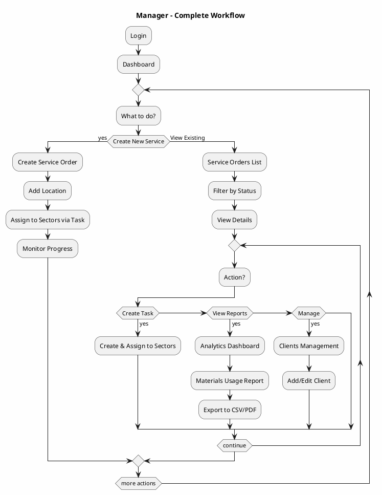

# Journey Diagram — Manager Workflow

```plantuml
@startuml Manager_Journey
skinparam backgroundColor #FEFEFE
title Manager - Complete Workflow

:Login;
:Dashboard;
repeat
  :What to do?;
  if (Create New Service) then (yes)
    :Create Service Order;
    :Add Location;
    :Assign to Sectors via Task;
    :Monitor Progress;
  else (View Existing)
    :Service Orders List;
    :Filter by Status;
    :View Details;
    repeat
      :Action?;
      if (Create Task) then (yes)
        :Create & Assign to Sectors;
      elseif (View Reports) then (yes)
        :Analytics Dashboard;
        :Materials Usage Report;
        :Export to CSV/PDF;
      elseif (Manage) then (yes)
        :Clients Management;
        :Add/Edit Client;
      endif
    repeat while (continue)
  endif
repeat while (more actions)

@enduml
```
