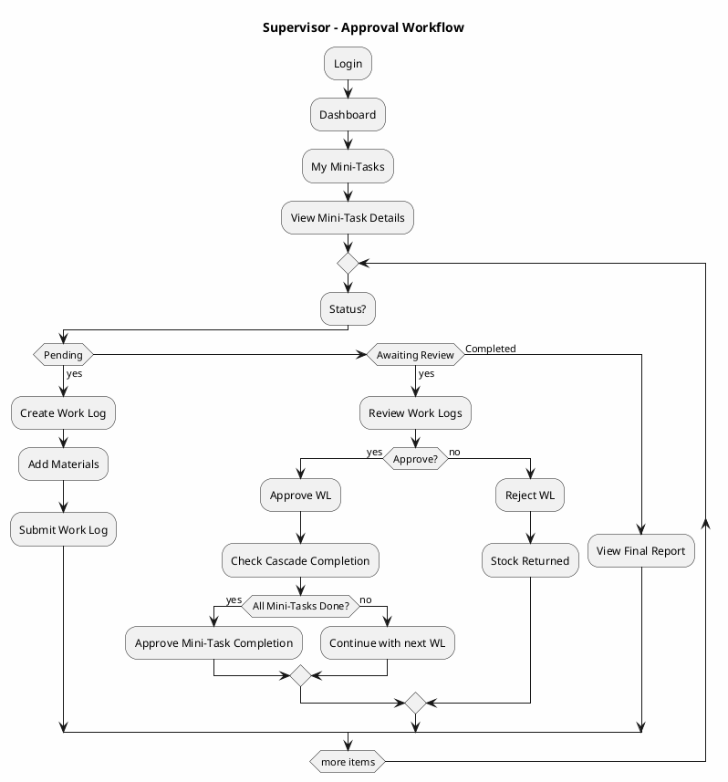

# Journey Diagram — Supervisor Workflow

```plantuml
@startuml Supervisor_Journey
skinparam backgroundColor #FEFEFE
title Supervisor - Approval Workflow

:Login;
:Dashboard;
:My Mini-Tasks;
:View Mini-Task Details;
repeat
  :Status?;
  if (Pending) then (yes)
    :Create Work Log;
    :Add Materials;
    :Submit Work Log;
  elseif (Awaiting Review) then (yes)
    :Review Work Logs;
    if (Approve?) then (yes)
      :Approve WL;
      :Check Cascade Completion;
      if (All Mini-Tasks Done?) then (yes)
        :Approve Mini-Task Completion;
      else (no)
        :Continue with next WL;
      endif
    else (no)
      :Reject WL;
      :Stock Returned;
    endif
  else (Completed)
    :View Final Report;
  endif
repeat while (more items)

@enduml
```
