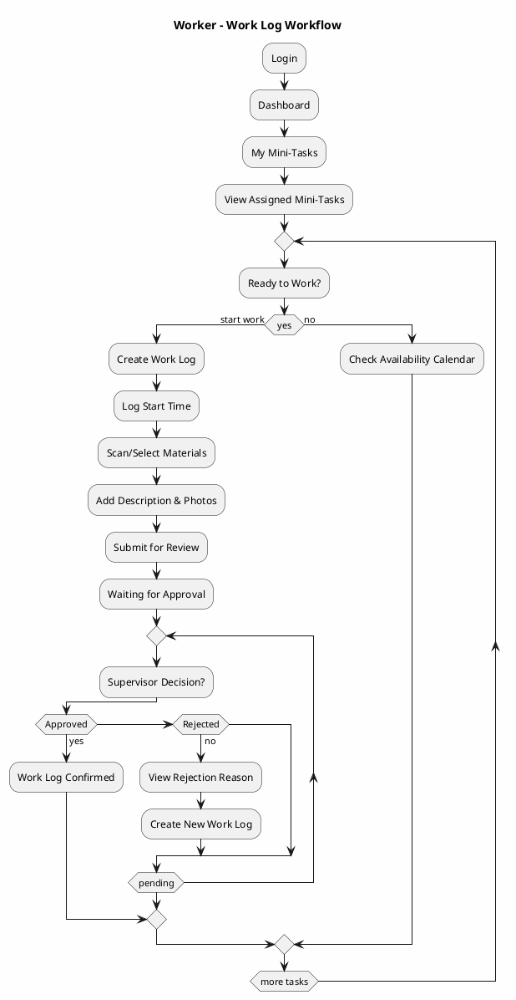

# Journey Diagram — Worker Workflow

```plantuml
@startuml Worker_Journey
skinparam backgroundColor #FEFEFE
title Worker - Work Log Workflow

:Login;
:Dashboard;
:My Mini-Tasks;
:View Assigned Mini-Tasks;
repeat
  :Ready to Work?;
  if (yes) then (start work)
    :Create Work Log;
    :Log Start Time;
    :Scan/Select Materials;
    :Add Description & Photos;
    :Submit for Review;
    :Waiting for Approval;
    repeat
      :Supervisor Decision?;
      if (Approved) then (yes)
        :Work Log Confirmed;
        break
      elseif (Rejected) then (no)
        :View Rejection Reason;
        :Create New Work Log;
      endif
    repeat while (pending)
  else (no)
    :Check Availability Calendar;
  endif
repeat while (more tasks)

@enduml
```
