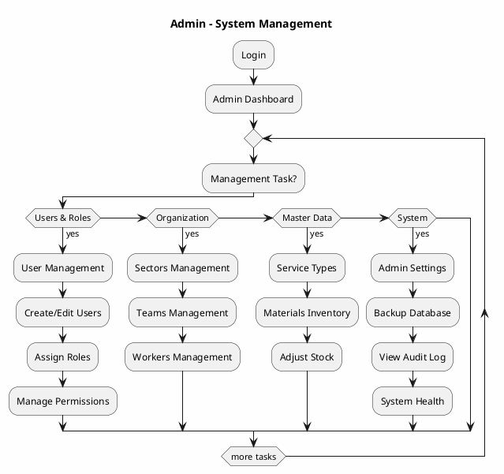

# Journey Diagram — Admin Workflow

```plantuml
@startuml Admin_Journey
skinparam backgroundColor #FEFEFE
title Admin - System Management

:Login;
:Admin Dashboard;
repeat
  :Management Task?;
  if (Users & Roles) then (yes)
    :User Management;
    :Create/Edit Users;
    :Assign Roles;
    :Manage Permissions;
  elseif (Organization) then (yes)
    :Sectors Management;
    :Teams Management;
    :Workers Management;
  elseif (Master Data) then (yes)
    :Service Types;
    :Materials Inventory;
    :Adjust Stock;
  elseif (System) then (yes)
    :Admin Settings;
    :Backup Database;
    :View Audit Log;
    :System Health;
  endif
repeat while (more tasks)

@enduml
```
