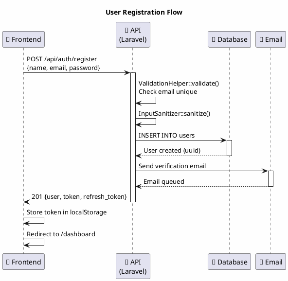

# Sequence Diagram — User Registration Flow

```plantuml
@startuml Registration_Flow
skinparam backgroundColor #FEFEFE
title User Registration Flow

participant "📱 Frontend" as FE
participant "🔌 API\n(Laravel)" as API
participant "💾 Database" as DB
participant "📧 Email" as EMAIL

FE -> API: POST /api/auth/register\n{name, email, password}
activate API
API -> API: ValidationHelper::validate()\nCheck email unique
API -> API: InputSanitizer::sanitize()
API -> DB: INSERT INTO users
activate DB
DB --> API: User created (uuid)
deactivate DB
API -> EMAIL: Send verification email
activate EMAIL
EMAIL --> API: Email queued
deactivate EMAIL
API --> FE: 201 {user, token, refresh_token}
deactivate API
FE -> FE: Store token in localStorage
FE -> FE: Redirect to /dashboard

@enduml
```
