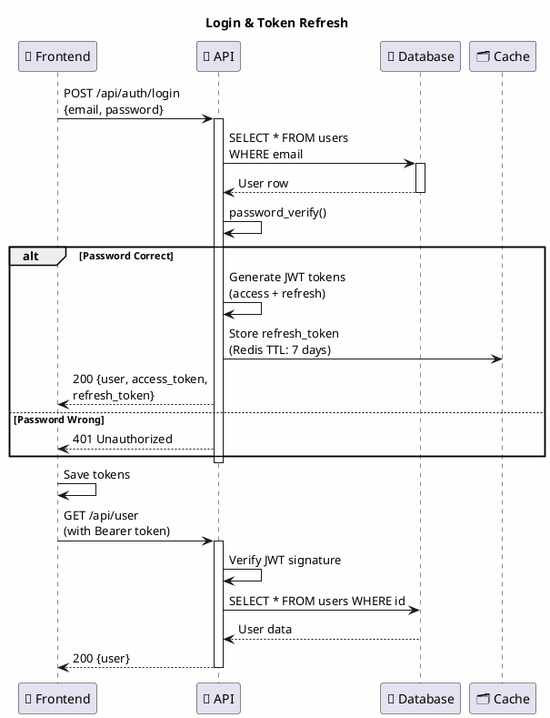

# Sequence Diagram — Login & Token Refresh

```plantuml
@startuml Login_TokenRefresh
skinparam backgroundColor #FEFEFE
title Login & Token Refresh

participant "📱 Frontend" as FE
participant "🔌 API" as API
participant "💾 Database" as DB
participant "🗂️ Cache" as CACHE

FE -> API: POST /api/auth/login\n{email, password}
activate API
API -> DB: SELECT * FROM users\nWHERE email
activate DB
DB --> API: User row
deactivate DB
API -> API: password_verify()
alt Password Correct
    API -> API: Generate JWT tokens\n(access + refresh)
    API -> CACHE: Store refresh_token\n(Redis TTL: 7 days)
    API --> FE: 200 {user, access_token,\nrefresh_token}
else Password Wrong
    API --> FE: 401 Unauthorized
end
deactivate API

FE -> FE: Save tokens
FE -> API: GET /api/user\n(with Bearer token)
activate API
API -> API: Verify JWT signature
API -> DB: SELECT * FROM users WHERE id
DB --> API: User data
API --> FE: 200 {user}
deactivate API

@enduml
```
