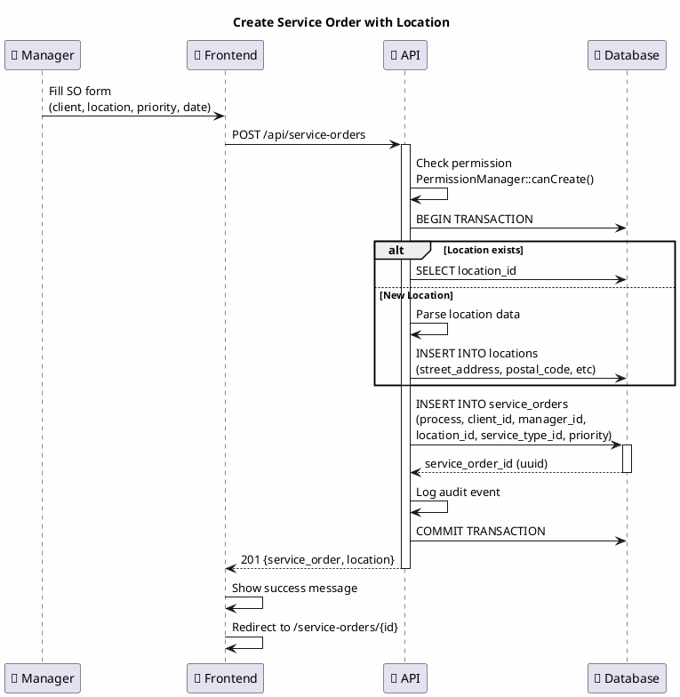

# Sequence Diagram — Create Service Order (with Location)

```plantuml
@startuml CreateServiceOrder
skinparam backgroundColor #FEFEFE
title Create Service Order with Location

participant "👔 Manager" as MGR
participant "📱 Frontend" as FE
participant "🔌 API" as API
participant "💾 Database" as DB

MGR -> FE: Fill SO form\n(client, location, priority, date)
FE -> API: POST /api/service-orders
activate API
API -> API: Check permission\nPermissionManager::canCreate()
API -> DB: BEGIN TRANSACTION

alt Location exists
    API -> DB: SELECT location_id
else New Location
    API -> API: Parse location data
    API -> DB: INSERT INTO locations\n(street_address, postal_code, etc)
end

API -> DB: INSERT INTO service_orders\n(process, client_id, manager_id,\nlocation_id, service_type_id, priority)
activate DB
DB --> API: service_order_id (uuid)
deactivate DB
API -> API: Log audit event
API -> DB: COMMIT TRANSACTION
API --> FE: 201 {service_order, location}
deactivate API
FE -> FE: Show success message
FE -> FE: Redirect to /service-orders/{id}

@enduml
```
