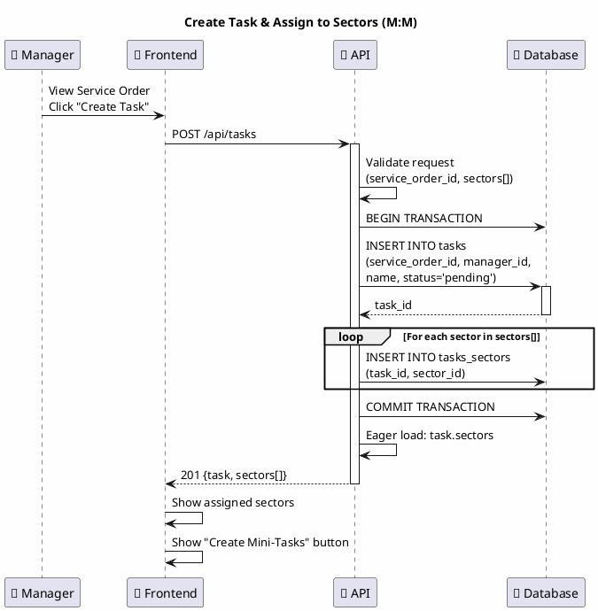

# Sequence Diagram — Create Task & Assign to Sectors

```plantuml
@startuml CreateTask_AssignSectors
skinparam backgroundColor #FEFEFE
title Create Task & Assign to Sectors (M:M)

participant "👔 Manager" as MGR
participant "📱 Frontend" as FE
participant "🔌 API" as API
participant "💾 Database" as DB

MGR -> FE: View Service Order\nClick "Create Task"
FE -> API: POST /api/tasks
activate API
API -> API: Validate request\n(service_order_id, sectors[])
API -> DB: BEGIN TRANSACTION
API -> DB: INSERT INTO tasks\n(service_order_id, manager_id,\nname, status='pending')
activate DB
DB --> API: task_id
deactivate DB
loop For each sector in sectors[]
    API -> DB: INSERT INTO tasks_sectors\n(task_id, sector_id)
end
API -> DB: COMMIT TRANSACTION
API -> API: Eager load: task.sectors
API --> FE: 201 {task, sectors[]}
deactivate API
FE -> FE: Show assigned sectors
FE -> FE: Show "Create Mini-Tasks" button

@enduml
```
