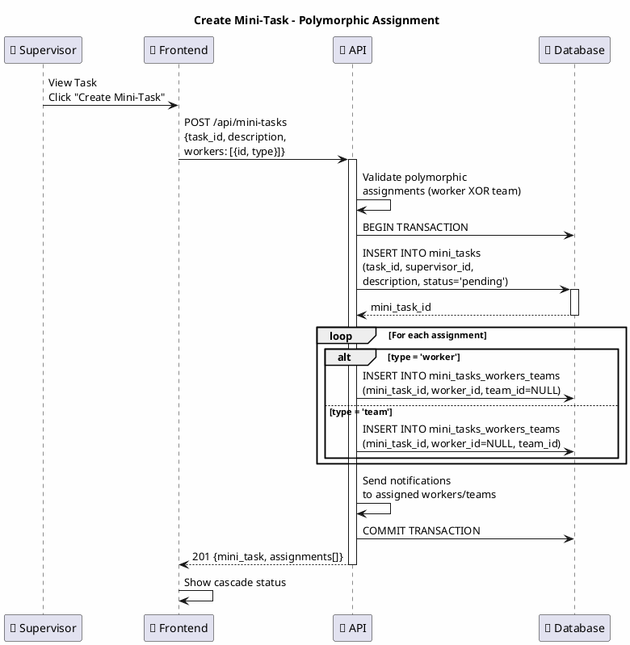

# Sequence Diagram — Create & Assign Mini-Task to Workers/Teams

```plantuml
@startuml CreateMiniTask_AssignWorkers
skinparam backgroundColor #FEFEFE
title Create Mini-Task - Polymorphic Assignment

participant "👷 Supervisor" as SUP
participant "📱 Frontend" as FE
participant "🔌 API" as API
participant "💾 Database" as DB

SUP -> FE: View Task\nClick "Create Mini-Task"
FE -> API: POST /api/mini-tasks\n{task_id, description,\nworkers: [{id, type}]}
activate API
API -> API: Validate polymorphic\nassignments (worker XOR team)
API -> DB: BEGIN TRANSACTION
API -> DB: INSERT INTO mini_tasks\n(task_id, supervisor_id,\ndescription, status='pending')
activate DB
DB --> API: mini_task_id
deactivate DB
loop For each assignment
    alt type = 'worker'
        API -> DB: INSERT INTO mini_tasks_workers_teams\n(mini_task_id, worker_id, team_id=NULL)
    else type = 'team'
        API -> DB: INSERT INTO mini_tasks_workers_teams\n(mini_task_id, worker_id=NULL, team_id)
    end
end
API -> API: Send notifications\nto assigned workers/teams
API -> DB: COMMIT TRANSACTION
API --> FE: 201 {mini_task, assignments[]}
deactivate API
FE -> FE: Show cascade status

@enduml
```
