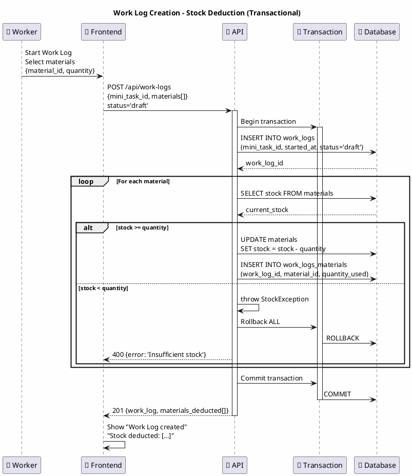

# Sequence Diagram — Create Work Log with Material Deduction (Transactional)

```plantuml
@startuml CreateWorkLog_MaterialDeduction
skinparam backgroundColor #FEFEFE
title Work Log Creation - Stock Deduction (Transactional)

participant "🔧 Worker" as WRK
participant "📱 Frontend" as FE
participant "🔌 API" as API
participant "🔄 Transaction" as TXN
participant "💾 Database" as DB

WRK -> FE: Start Work Log\nSelect materials\n{material_id, quantity}
FE -> API: POST /api/work-logs\n{mini_task_id, materials[]}\nstatus='draft'
activate API
API -> TXN: Begin transaction
activate TXN
API -> DB: INSERT INTO work_logs\n(mini_task_id, started_at, status='draft')
DB --> API: work_log_id
loop For each material
    API -> DB: SELECT stock FROM materials
    DB --> API: current_stock
    alt stock >= quantity
        API -> DB: UPDATE materials\nSET stock = stock - quantity
        API -> DB: INSERT INTO work_logs_materials\n(work_log_id, material_id, quantity_used)
    else stock < quantity
        API -> API: throw StockException
        API -> TXN: Rollback ALL
        TXN -> DB: ROLLBACK
        API --> FE: 400 {error: 'Insufficient stock'}
    end
end
API -> TXN: Commit transaction
TXN -> DB: COMMIT
deactivate TXN
API --> FE: 201 {work_log, materials_deducted[]}
deactivate API
FE -> FE: Show "Work Log created"\n"Stock deducted: [...]"

@enduml
```
