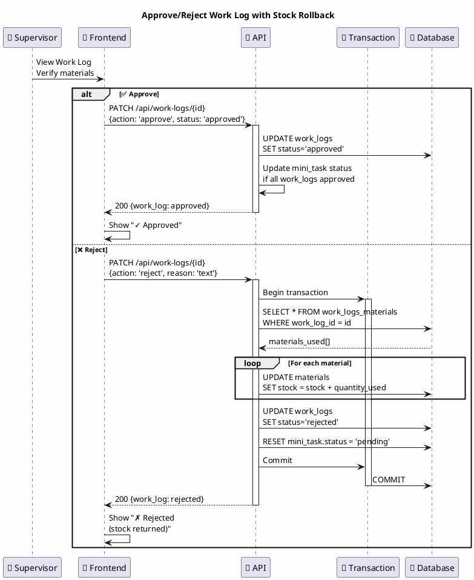

# Sequence Diagram — Approve / Reject Work Log

```plantuml
@startuml ApproveRejectWorkLog
skinparam backgroundColor #FEFEFE
title Approve/Reject Work Log with Stock Rollback

participant "👷 Supervisor" as SUP
participant "📱 Frontend" as FE
participant "🔌 API" as API
participant "🔄 Transaction" as TXN
participant "💾 Database" as DB

SUP -> FE: View Work Log\nVerify materials

alt ✅ Approve
    FE -> API: PATCH /api/work-logs/{id}\n{action: 'approve', status: 'approved'}
    activate API
    API -> DB: UPDATE work_logs\nSET status='approved'
    API -> API: Update mini_task status\nif all work_logs approved
    API --> FE: 200 {work_log: approved}
    deactivate API
    FE -> FE: Show "✓ Approved"
else ❌ Reject
    FE -> API: PATCH /api/work-logs/{id}\n{action: 'reject', reason: 'text'}
    activate API
    API -> TXN: Begin transaction
    activate TXN
    API -> DB: SELECT * FROM work_logs_materials\nWHERE work_log_id = id
    DB --> API: materials_used[]
    loop For each material
        API -> DB: UPDATE materials\nSET stock = stock + quantity_used
    end
    API -> DB: UPDATE work_logs\nSET status='rejected'
    API -> DB: RESET mini_task.status = 'pending'
    API -> TXN: Commit
    TXN -> DB: COMMIT
    deactivate TXN
    API --> FE: 200 {work_log: rejected}
    deactivate API
    FE -> FE: Show "✗ Rejected\n(stock returned)"
end

@enduml
```
