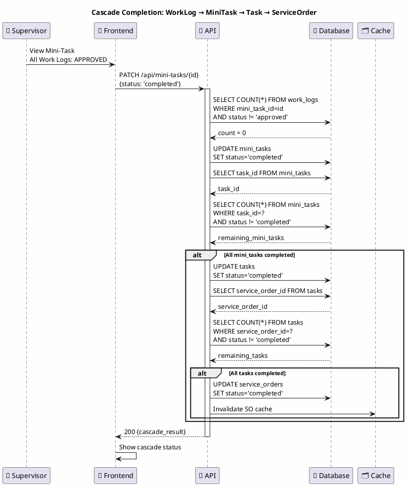

# Sequence Diagram — Cascade Completion (WorkLog → MiniTask → Task → ServiceOrder)

```plantuml
@startuml CascadeCompletion
skinparam backgroundColor #FEFEFE
title Cascade Completion: WorkLog → MiniTask → Task → ServiceOrder

participant "👷 Supervisor" as SUP
participant "📱 Frontend" as FE
participant "🔌 API" as API
participant "💾 Database" as DB
participant "🗂️ Cache" as CACHE

SUP -> FE: View Mini-Task\nAll Work Logs: APPROVED
FE -> API: PATCH /api/mini-tasks/{id}\n{status: 'completed'}
activate API
API -> DB: SELECT COUNT(*) FROM work_logs\nWHERE mini_task_id=id\nAND status != 'approved'
DB --> API: count = 0
API -> DB: UPDATE mini_tasks\nSET status='completed'
API -> DB: SELECT task_id FROM mini_tasks
DB --> API: task_id
API -> DB: SELECT COUNT(*) FROM mini_tasks\nWHERE task_id=?\nAND status != 'completed'
DB --> API: remaining_mini_tasks
alt All mini_tasks completed
    API -> DB: UPDATE tasks\nSET status='completed'
    API -> DB: SELECT service_order_id FROM tasks
    DB --> API: service_order_id
    API -> DB: SELECT COUNT(*) FROM tasks\nWHERE service_order_id=?\nAND status != 'completed'
    DB --> API: remaining_tasks
    alt All tasks completed
        API -> DB: UPDATE service_orders\nSET status='completed'
        API -> CACHE: Invalidate SO cache
    end
end
API --> FE: 200 {cascade_result}
deactivate API
FE -> FE: Show cascade status

@enduml
```
