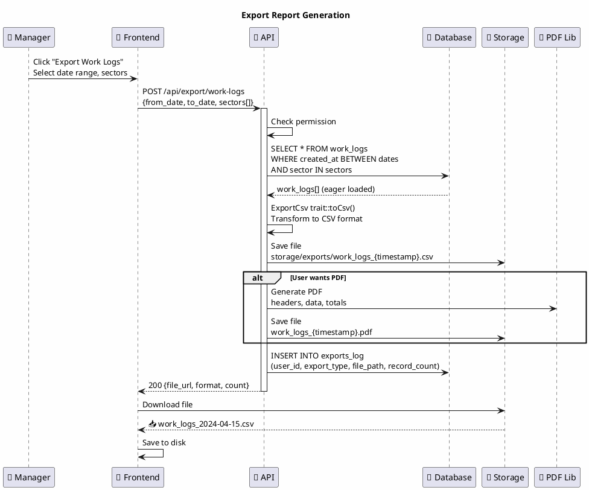

# Sequence Diagram — Export Report (CSV/PDF)

```plantuml
@startuml ExportReport
skinparam backgroundColor #FEFEFE
title Export Report Generation

participant "👔 Manager" as MGR
participant "📱 Frontend" as FE
participant "🔌 API" as API
participant "💾 Database" as DB
participant "📁 Storage" as STORE
participant "📄 PDF Lib" as PDF

MGR -> FE: Click "Export Work Logs"\nSelect date range, sectors
FE -> API: POST /api/export/work-logs\n{from_date, to_date, sectors[]}
activate API
API -> API: Check permission
API -> DB: SELECT * FROM work_logs\nWHERE created_at BETWEEN dates\nAND sector IN sectors
DB --> API: work_logs[] (eager loaded)
API -> API: ExportCsv trait::toCsv()\nTransform to CSV format
API -> STORE: Save file\nstorage/exports/work_logs_{timestamp}.csv
alt User wants PDF
    API -> PDF: Generate PDF\nheaders, data, totals
    API -> STORE: Save file\nwork_logs_{timestamp}.pdf
end
API -> DB: INSERT INTO exports_log\n(user_id, export_type, file_path, record_count)
API --> FE: 200 {file_url, format, count}
deactivate API
FE -> STORE: Download file
STORE --> FE: 📥 work_logs_2024-04-15.csv
FE -> FE: Save to disk

@enduml
```
