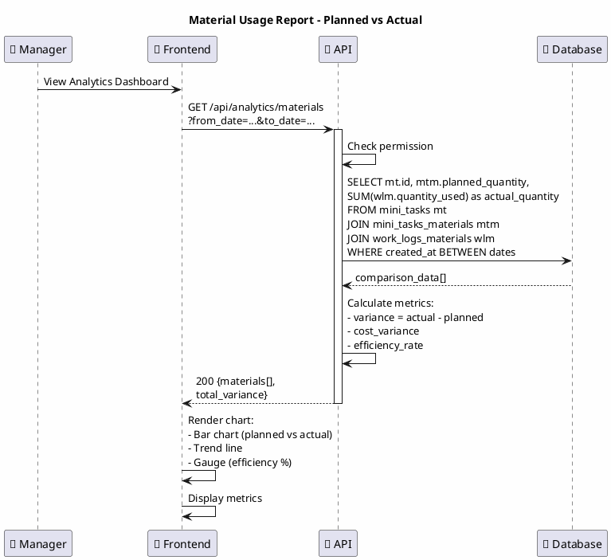

# Sequence Diagram — Material Usage Analytics (Planned vs Actual)

```plantuml
@startuml MaterialAnalytics
skinparam backgroundColor #FEFEFE
title Material Usage Report - Planned vs Actual

participant "👔 Manager" as MGR
participant "📱 Frontend" as FE
participant "🔌 API" as API
participant "💾 Database" as DB

MGR -> FE: View Analytics Dashboard
FE -> API: GET /api/analytics/materials\n?from_date=...&to_date=...
activate API
API -> API: Check permission
API -> DB: SELECT mt.id, mtm.planned_quantity,\nSUM(wlm.quantity_used) as actual_quantity\nFROM mini_tasks mt\nJOIN mini_tasks_materials mtm\nJOIN work_logs_materials wlm\nWHERE created_at BETWEEN dates
DB --> API: comparison_data[]
API -> API: Calculate metrics:\n- variance = actual - planned\n- cost_variance\n- efficiency_rate
API --> FE: 200 {materials[],\ntotal_variance}
deactivate API
FE -> FE: Render chart:\n- Bar chart (planned vs actual)\n- Trend line\n- Gauge (efficiency %)
FE -> FE: Display metrics

@enduml
```
