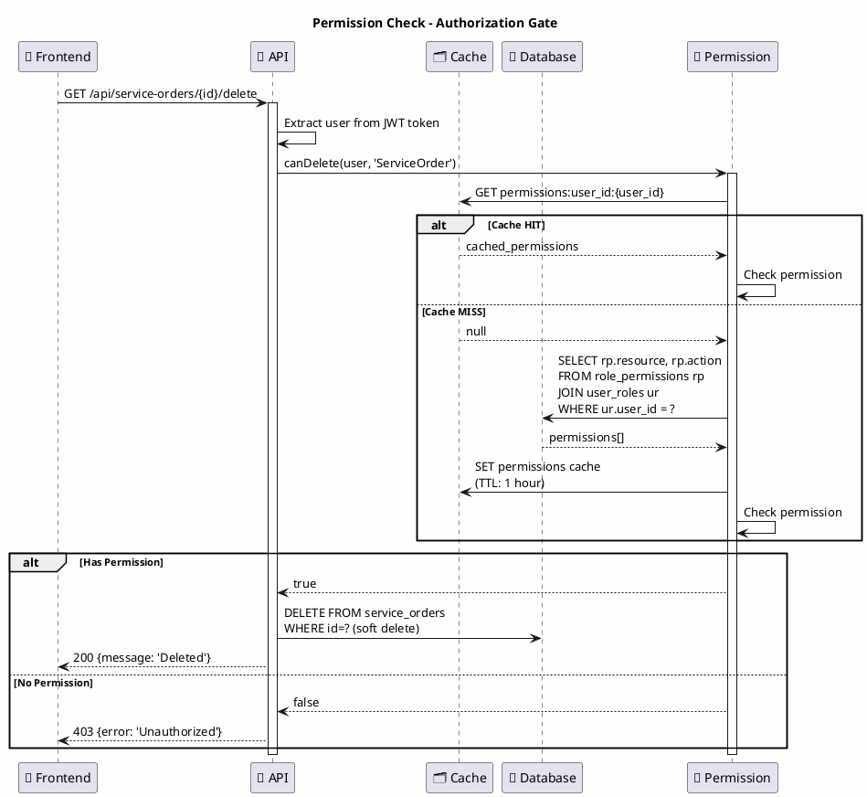

# Sequence Diagram — Permission Check (RBAC Authorization Gate)

```plantuml
@startuml PermissionCheck_RBAC
skinparam backgroundColor #FEFEFE
title Permission Check - Authorization Gate

participant "📱 Frontend" as FE
participant "🔌 API" as API
participant "🗂️ Cache" as CACHE
participant "💾 Database" as DB
participant "🔑 Permission" as PERM

FE -> API: GET /api/service-orders/{id}/delete
activate API
API -> API: Extract user from JWT token
API -> PERM: canDelete(user, 'ServiceOrder')
activate PERM
PERM -> CACHE: GET permissions:user_id:{user_id}
alt Cache HIT
    CACHE --> PERM: cached_permissions
    PERM -> PERM: Check permission
else Cache MISS
    CACHE --> PERM: null
    PERM -> DB: SELECT rp.resource, rp.action\nFROM role_permissions rp\nJOIN user_roles ur\nWHERE ur.user_id = ?
    DB --> PERM: permissions[]
    PERM -> CACHE: SET permissions cache\n(TTL: 1 hour)
    PERM -> PERM: Check permission
end
alt Has Permission
    PERM --> API: true
    API -> DB: DELETE FROM service_orders\nWHERE id=? (soft delete)
    API --> FE: 200 {message: 'Deleted'}
else No Permission
    PERM --> API: false
    API --> FE: 403 {error: 'Unauthorized'}
end
deactivate PERM
deactivate API

@enduml
```
