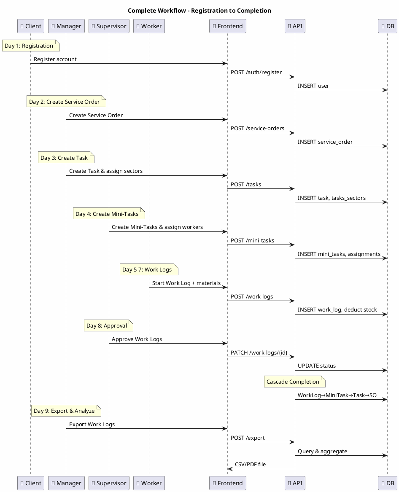

# Sequence Diagram — Complete End-to-End Cycle

```plantuml
@startuml EndToEnd_Complete
skinparam backgroundColor #FEFEFE
title Complete Workflow - Registration to Completion

participant "👥 Client" as CLIENT
participant "👔 Manager" as MGR
participant "👷 Supervisor" as SUP
participant "🔧 Worker" as WRK
participant "📱 Frontend" as FE
participant "🔌 API" as API
participant "💾 DB" as DB

note over CLIENT: Day 1: Registration
CLIENT -> FE: Register account
FE -> API: POST /auth/register
API -> DB: INSERT user

note over MGR: Day 2: Create Service Order
MGR -> FE: Create Service Order
FE -> API: POST /service-orders
API -> DB: INSERT service_order

note over MGR: Day 3: Create Task
MGR -> FE: Create Task & assign sectors
FE -> API: POST /tasks
API -> DB: INSERT task, tasks_sectors

note over SUP: Day 4: Create Mini-Tasks
SUP -> FE: Create Mini-Tasks & assign workers
FE -> API: POST /mini-tasks
API -> DB: INSERT mini_tasks, assignments

note over WRK: Day 5-7: Work Logs
WRK -> FE: Start Work Log + materials
FE -> API: POST /work-logs
API -> DB: INSERT work_log, deduct stock

note over SUP: Day 8: Approval
SUP -> FE: Approve Work Logs
FE -> API: PATCH /work-logs/{id}
API -> DB: UPDATE status

note over API: Cascade Completion
API -> DB: WorkLog→MiniTask→Task→SO

note over MGR: Day 9: Export & Analyze
MGR -> FE: Export Work Logs
FE -> API: POST /export
API -> DB: Query & aggregate
API -> FE: CSV/PDF file

@enduml
```
