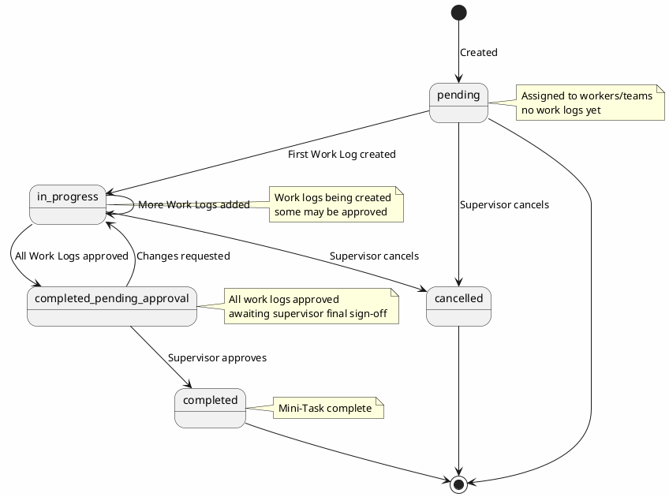

# State Machine — Mini-Task Lifecycle

```plantuml
@startuml MiniTask_Lifecycle
skinparam backgroundColor #FEFEFE

state pending
note right of pending : Assigned to workers/teams\nno work logs yet

state in_progress
note right of in_progress : Work logs being created\nsome may be approved

state completed_pending_approval
note right of completed_pending_approval : All work logs approved\nawaiting supervisor final sign-off

state completed
note right of completed : Mini-Task complete

state cancelled

[*] --> pending: Created

pending --> in_progress: First Work Log created
pending --> cancelled: Supervisor cancels
pending --> [*]

in_progress --> in_progress: More Work Logs added
in_progress --> completed_pending_approval: All Work Logs approved
in_progress --> cancelled: Supervisor cancels

completed_pending_approval --> completed: Supervisor approves
completed_pending_approval --> in_progress: Changes requested

completed --> [*]
cancelled --> [*]

@enduml
```
