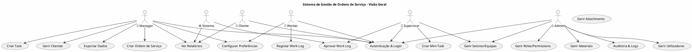

# UML Use Case — System Overview

```plantuml
@startuml System_Overview
skinparam backgroundColor #FEFEFE
skinparam classBackgroundColor #F0F0F0
skinparam classBorderColor #333333

title Sistema de Gestão de Ordens de Serviço - Visão Geral

' Actors
:🔐 Admin: as Admin
:👔 Manager: as Manager
:👷 Supervisor: as Supervisor
:🔧 Worker: as Worker
:👥 Cliente: as Client
:⚙️ Sistema: as System

' Use Cases
(Autenticação & Login) as UC1
(Gerir Utilizadores) as UC2
(Gerir Roles/Permissions) as UC3
(Criar Ordem de Serviço) as UC4
(Criar Task) as UC5
(Criar Mini-Task) as UC6
(Registar Work Log) as UC7
(Aprovar Work Log) as UC8
(Gerir Clientes) as UC9
(Gerir Materiais) as UC10
(Gerir Setores/Equipas) as UC11
(Exportar Dados) as UC12
(Ver Relatórios) as UC13
(Gerir Attachments) as UC14
(Configurar Preferências) as UC15
(Auditoria & Logs) as UC16

' Relationships - Admin
Admin --> UC1
Admin --> UC2
Admin --> UC3
Admin --> UC10
Admin --> UC11
Admin --> UC16

' Relationships - Manager
Manager --> UC1
Manager --> UC4
Manager --> UC5
Manager --> UC9
Manager --> UC13
Manager --> UC12
Manager --> UC15

' Relationships - Supervisor
Supervisor --> UC1
Supervisor --> UC6
Supervisor --> UC8
Supervisor --> UC11

' Relationships - Worker
Worker --> UC1
Worker --> UC7
Worker --> UC15

' Relationships - Client
Client --> UC1
Client --> UC13

' Relationships - System
System --> UC8
System --> UC13

@enduml
```
