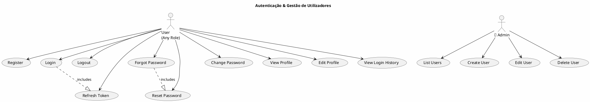

# UML Use Case — Authentication & User Management

```plantuml
@startuml Auth_UserManagement
skinparam backgroundColor #FEFEFE
title Autenticação & Gestão de Utilizadores

:User\n(Any Role): as User
:🔐 Admin: as Admin

(Register) as UC_REG
(Login) as UC_LOGIN
(Logout) as UC_LOGOUT
(Refresh Token) as UC_REFRESH
(Forgot Password) as UC_FORGOT
(Reset Password) as UC_RESET
(Change Password) as UC_CHPASS
(View Profile) as UC_PROFILE
(Edit Profile) as UC_EDIT_PROFILE
(List Users) as UC_LIST_USERS
(Create User) as UC_CREATE_USER
(Edit User) as UC_EDIT_USER
(Delete User) as UC_DELETE_USER
(View Login History) as UC_LOGIN_HIST

User --> UC_REG
User --> UC_LOGIN
User --> UC_LOGOUT
User --> UC_REFRESH
User --> UC_FORGOT
User --> UC_RESET
User --> UC_PROFILE
User --> UC_EDIT_PROFILE
User --> UC_CHPASS
User --> UC_LOGIN_HIST

Admin --> UC_LIST_USERS
Admin --> UC_CREATE_USER
Admin --> UC_EDIT_USER
Admin --> UC_DELETE_USER

UC_LOGIN ..|> UC_REFRESH : includes
UC_FORGOT ..|> UC_RESET : includes

@enduml
```
