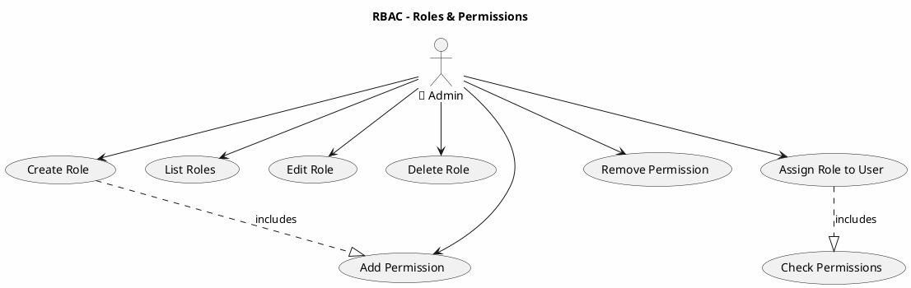

# UML Use Case — Roles & Permissions (RBAC)

```plantuml
@startuml RBAC_RolesPermissions
skinparam backgroundColor #FEFEFE
title RBAC - Roles & Permissions

:🔐 Admin: as Admin

(Create Role) as UC_CREATE_ROLE
(List Roles) as UC_LIST_ROLES
(Edit Role) as UC_EDIT_ROLE
(Delete Role) as UC_DELETE_ROLE
(Add Permission) as UC_ADD_PERM
(Remove Permission) as UC_REMOVE_PERM
(Assign Role to User) as UC_ASSIGN_ROLE
(Check Permissions) as UC_CHECK_PERM

Admin --> UC_CREATE_ROLE
Admin --> UC_LIST_ROLES
Admin --> UC_EDIT_ROLE
Admin --> UC_DELETE_ROLE
Admin --> UC_ADD_PERM
Admin --> UC_REMOVE_PERM
Admin --> UC_ASSIGN_ROLE

UC_CREATE_ROLE ..|> UC_ADD_PERM : includes
UC_ASSIGN_ROLE ..|> UC_CHECK_PERM : includes

@enduml
```
