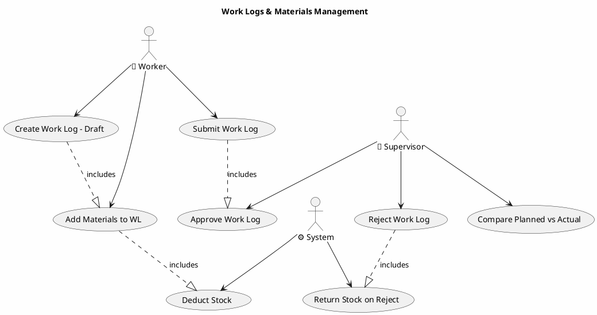

# UML Use Case — Work Logs & Materials Workflow

```plantuml
@startuml WorkLogs_Materials
skinparam backgroundColor #FEFEFE
title Work Logs & Materials Management

:🔧 Worker: as Worker
:👷 Supervisor: as Supervisor
:⚙️ System: as System

(Create Work Log - Draft) as UC_CREATE_WL
(Add Materials to WL) as UC_ADD_MAT_WL
(Submit Work Log) as UC_SUBMIT_WL
(Approve Work Log) as UC_APPROVE_WL
(Reject Work Log) as UC_REJECT_WL
(Deduct Stock) as UC_DEDUCT_STOCK
(Return Stock on Reject) as UC_RETURN_STOCK
(Compare Planned vs Actual) as UC_COMPARE_MAT

Worker --> UC_CREATE_WL
Worker --> UC_ADD_MAT_WL
Worker --> UC_SUBMIT_WL

Supervisor --> UC_APPROVE_WL
Supervisor --> UC_REJECT_WL
Supervisor --> UC_COMPARE_MAT

System --> UC_DEDUCT_STOCK
System --> UC_RETURN_STOCK

UC_CREATE_WL ..|> UC_ADD_MAT_WL : includes
UC_ADD_MAT_WL ..|> UC_DEDUCT_STOCK : includes
UC_SUBMIT_WL ..|> UC_APPROVE_WL : includes
UC_REJECT_WL ..|> UC_RETURN_STOCK : includes

@enduml
```
