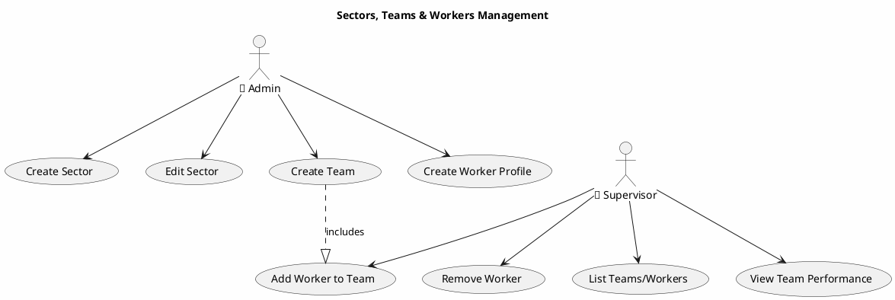

# UML Use Case — Organization Management (Sectors, Teams & Workers)

```plantuml
@startuml Organization_Structure
skinparam backgroundColor #FEFEFE
title Sectors, Teams & Workers Management

:🔐 Admin: as Admin
:👷 Supervisor: as Supervisor

(Create Sector) as UC_CREATE_SECT
(Edit Sector) as UC_EDIT_SECT
(Create Team) as UC_CREATE_TEAM
(Add Worker to Team) as UC_ADD_WORKER
(Remove Worker) as UC_REMOVE_WORKER
(Create Worker Profile) as UC_CREATE_WORKER
(List Teams/Workers) as UC_LIST_TEAMS
(View Team Performance) as UC_PERF_TEAM

Admin --> UC_CREATE_SECT
Admin --> UC_EDIT_SECT
Admin --> UC_CREATE_TEAM
Admin --> UC_CREATE_WORKER

Supervisor --> UC_ADD_WORKER
Supervisor --> UC_REMOVE_WORKER
Supervisor --> UC_LIST_TEAMS
Supervisor --> UC_PERF_TEAM

UC_CREATE_TEAM ..|> UC_ADD_WORKER : includes

@enduml
```
