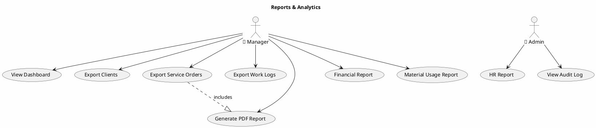

# UML Use Case — Reports & Analytics

```plantuml
@startuml Reports_Analytics
skinparam backgroundColor #FEFEFE
title Reports & Analytics

:👔 Manager: as Manager
:🔐 Admin: as Admin

(View Dashboard) as UC_DASHBOARD
(Export Clients) as UC_EXPORT_CLIENTS
(Export Service Orders) as UC_EXPORT_SO
(Export Work Logs) as UC_EXPORT_WL
(Generate PDF Report) as UC_PDF_REPORT
(Financial Report) as UC_FIN_REPORT
(HR Report) as UC_HR_REPORT
(Material Usage Report) as UC_MAT_REPORT
(View Audit Log) as UC_AUDIT

Manager --> UC_DASHBOARD
Manager --> UC_EXPORT_CLIENTS
Manager --> UC_EXPORT_SO
Manager --> UC_EXPORT_WL
Manager --> UC_PDF_REPORT
Manager --> UC_FIN_REPORT
Manager --> UC_MAT_REPORT

Admin --> UC_AUDIT
Admin --> UC_HR_REPORT

UC_EXPORT_SO ..|> UC_PDF_REPORT : includes

@enduml
```
