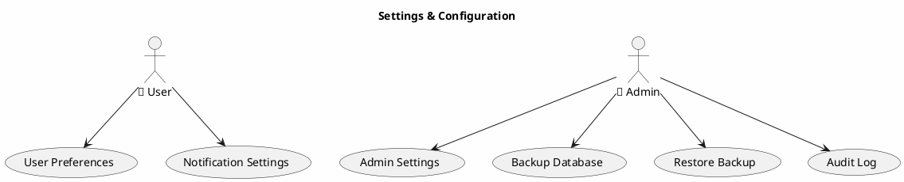

# UML Use Case — System Configuration & Settings

```plantuml
@startuml Settings_Configuration
skinparam backgroundColor #FEFEFE
title Settings & Configuration

:👤 User: as User
:🔐 Admin: as Admin

(User Preferences) as UC_USER_PREFS
(Notification Settings) as UC_NOTIF_PREFS
(Admin Settings) as UC_ADMIN_SETTINGS
(Backup Database) as UC_BACKUP
(Restore Backup) as UC_RESTORE
(Audit Log) as UC_AUDIT_LOG

User --> UC_USER_PREFS
User --> UC_NOTIF_PREFS

Admin --> UC_ADMIN_SETTINGS
Admin --> UC_BACKUP
Admin --> UC_RESTORE
Admin --> UC_AUDIT_LOG

@enduml
```
