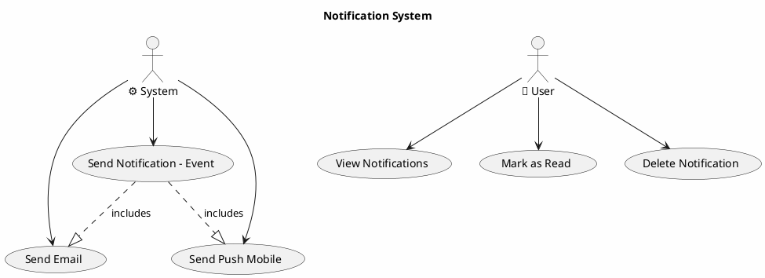

# UML Use Case — Notification System

```plantuml
@startuml Notifications
skinparam backgroundColor #FEFEFE
title Notification System

:⚙️ System: as System
:👤 User: as User

(Send Notification - Event) as UC_SEND_NOTIF
(View Notifications) as UC_VIEW_NOTIF
(Mark as Read) as UC_READ_NOTIF
(Delete Notification) as UC_DELETE_NOTIF
(Send Email) as UC_EMAIL
(Send Push Mobile) as UC_PUSH

System --> UC_SEND_NOTIF
System --> UC_EMAIL
System --> UC_PUSH

User --> UC_VIEW_NOTIF
User --> UC_READ_NOTIF
User --> UC_DELETE_NOTIF

UC_SEND_NOTIF ..|> UC_EMAIL : includes
UC_SEND_NOTIF ..|> UC_PUSH : includes

@enduml
```
