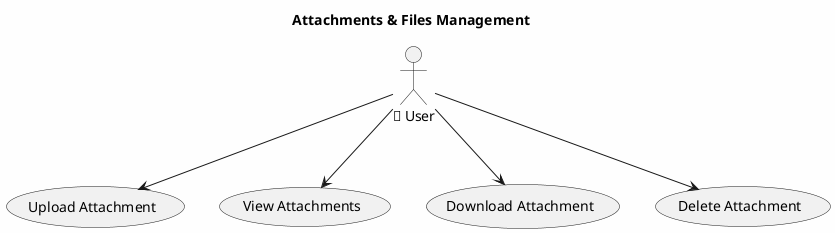

# UML Use Case — Attachments & Files

```plantuml
@startuml Attachments
skinparam backgroundColor #FEFEFE
title Attachments & Files Management

:👤 User: as User

(Upload Attachment) as UC_UPLOAD_ATT
(View Attachments) as UC_VIEW_ATT
(Download Attachment) as UC_DOWNLOAD_ATT
(Delete Attachment) as UC_DELETE_ATT

User --> UC_UPLOAD_ATT
User --> UC_VIEW_ATT
User --> UC_DOWNLOAD_ATT
User --> UC_DELETE_ATT

@enduml
```
