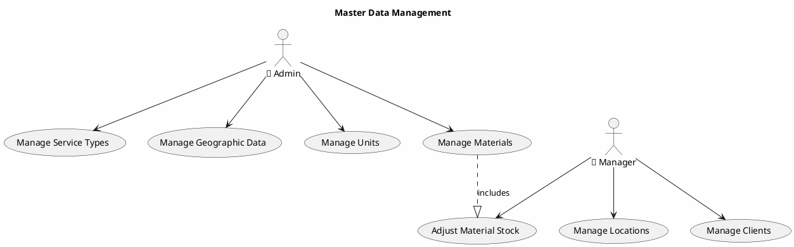

# UML Use Case — Master Data Management

```plantuml
@startuml MasterData
skinparam backgroundColor #FEFEFE
title Master Data Management

:🔐 Admin: as Admin
:👔 Manager: as Manager

(Manage Service Types) as UC_SERVICE_TYPE
(Manage Geographic Data) as UC_GEOGRAPHY
(Manage Locations) as UC_LOCATIONS
(Manage Units) as UC_UNITS
(Manage Materials) as UC_MATERIALS
(Adjust Material Stock) as UC_ADJUST_STOCK
(Manage Clients) as UC_CLIENTS

Admin --> UC_SERVICE_TYPE
Admin --> UC_GEOGRAPHY
Admin --> UC_UNITS
Admin --> UC_MATERIALS

Manager --> UC_LOCATIONS
Manager --> UC_ADJUST_STOCK
Manager --> UC_CLIENTS

UC_MATERIALS ..|> UC_ADJUST_STOCK : includes

@enduml
```
