# Phase 2 & 3 — Frontend Refactoring Plan

## Architecture Overview

```mermaid
flowchart TD
    subgraph Phase2[Phase 2 — Consolidation]
        P2_1[2.1 Style Constants] --> enums_js[enums.js]
        P2_2[2.2 Tabs Component] --> Tabs[Components/Common/Tabs.jsx]
        P2_3[2.3 Settings Refactor] --> FormSection[Components/Common/FormSection.jsx]
        P2_3 --> formUtils[utils/form.js]
        P2_3 --> DialogModal
        P2_4[2.4 CSV Export] --> exportUtils[utils/export.js]
    end

    subgraph Phase3[Phase 3 — Polish]
        P3_1[3.1 KpiCard] --> KpiCard[Components/Common/KpiCard.jsx]
        P3_2[3.2 SectionHeader] --> SectionHeader[Components/Common/SectionHeader.jsx]
        P3_3[3.3 PhotoListener] --> usePhotoListener[Hooks/usePhotoListener.js]
        P3_4[3.4 Nav Data] --> sidebarData[data/sidebar.js]
    end

    enums_js --> Row_jsx[Row.jsx]
    enums_js --> SO_Index[ServiceOrders/Index.jsx]
    Tabs --> Settings_jsx[Settings.jsx]
    Tabs --> WorkspaceDrawer[WorkspaceDrawer.jsx]
    FormSection --> Settings_jsx
    formUtils --> Settings_jsx
    DialogModal --> Settings_jsx
    exportUtils --> filterbar[filterbar.jsx]
    KpiCard --> Dashboard[Dashboard.jsx]
    SectionHeader --> Dashboard
    usePhotoListener --> SO_Index
    sidebarData --> Sidebar[SideBar/index.jsx]
```



## Phase 2 — Consolidation

### 2.1 Centralise Style Constants (Semantic Variants)

**Files to create:** None (add to `resources/js/utils/enums.js`)

**Files to modify:**
- `resources/js/utils/enums.js` — add `BADGE_VARIANT`, `DOT_VARIANT`, `STATUS_VARIANT`, `PRIORITY_VARIANT`, `badgeStyle(value)` helper
- `resources/js/Components/Table/Row.jsx` — remove `BADGE_COLORS` + `badgeColor()`, import `badgeStyle` from enums
- `resources/js/Features/ServiceOrders/Pages/Index.jsx` — remove `STATUS_STYLE` + `PRIORITY_STYLE`, import `badgeStyle`

**Design:**
```js
// Semantic colour palette (single source of truth)
const BADGE_VARIANT = {
  success: 'bg-green-500/20 text-green-300',
  warning: 'bg-yellow-500/20 text-yellow-300',
  danger:  'bg-red-500/20 text-red-300',
  info:    'bg-blue-500/20 text-blue-300',
  neutral: 'bg-slate-500/20 text-slate-400',
  urgent:  'bg-orange-500/20 text-orange-300',
  teal:    'bg-teal-500/20 text-teal-300',
};

// Business value → variant mapping
const STATUS_VARIANT = {
  pending: 'warning', in_progress: 'info', completed: 'success',
  cancelled: 'danger', canceled: 'danger', done: 'success',
  finished: 'success', active: 'info', // + equipment statuses
};
const PRIORITY_VARIANT = {
  low: 'teal', normal: 'neutral', high: 'urgent', urgent: 'danger',
};

export function badgeStyle(value) { ... }
```

**Note:** Fixes the existing inconsistency where `cancelled` is `bg-slate` in Row.jsx but `bg-red` in ServiceOrders.

---

### 2.2 Create Shared Tabs Component

**Files to create:** `resources/js/Components/Common/Tabs.jsx`

**Files to modify:**
- `resources/js/Features/Settings/Pages/Settings.jsx` — replace inline `TabPanel` + nav tabs with `<Tabs>` component
- `resources/js/Components/Drawer/WorkspaceDrawer.jsx` — use shared `<Tabs>` component

**API (uncontrolled + flat props):**
```jsx
<Tabs
  tabs={[
    { id: 'details', label: 'Details', content: <div>...</div> },
    { id: 'history', label: 'History', content: <div>...</div> },
  ]}
  defaultTab="details"
  onChange={(id) => console.log(id)} // optional callback
/>
```

---

### 2.3 Refactor Settings Page

**Files to create:**
- `resources/js/Components/Common/FormSection.jsx` — layout wrapper (title + description + children)

**Files to modify:**
- `resources/js/Features/Settings/Pages/Settings.jsx` — see full refactor below

**What changes in Settings.jsx (587 → ~380 lines):**

| Change | Savings | Details |
|---|---|---|
| Remove inline `Toast` (L6-27) | ~22 lines | Use existing centralized toast system |
| Remove inline `TabPanel` (L30-37) | ~8 lines | Replaced by shared `<Tabs>` |
| Remove inline `FormSection` (L40-50) | ~11 lines | Import from `Components/Common/FormSection.jsx` |
| Extract `submitForm` to `utils/form.js` | ~44 lines | Reusable form submission + validation handler |
| Refactor `handlePasswordSubmit` to reuse `submitForm` | ~39 lines | Currently duplicates the same logic inline |
| Replace delete modal with `DialogModal` | ~38 lines | Use existing confirmation dialog component |
| Replace inline tab navigation with `<Tabs>` | ~50 lines | Shared component handles rendering |

**File to create:** `resources/js/utils/form.js`
```js
export async function submitForm(formEl, endpoint, options = {}) {
  // Generic fetch + validation logic from Settings.jsx lines 53-96
  // Handles: loading state on submit button, validation errors, success/error response
}
```

---

### 2.4 Extract CSV Export to Utility

**Files to create:** `resources/js/utils/export.js`

**Files to modify:**
- `resources/js/Components/DataManager/filterbar.jsx` — replace inline `handleExport` with import

**Extracted function:**
```js
export async function exportCSV(model) {
  if (!model) {
    const parts = window.location.pathname.split('/').filter(Boolean);
    model = parts[parts.length - 1];
  }
  // fetch + blob download logic
}
```

---

## Phase 3 — Polish

### 3.1 Extract KpiCard Component

**Files to create:** `resources/js/Components/Common/KpiCard.jsx`

**Files to modify:**
- `resources/js/Features/Dashboard/Pages/Dashboard.jsx` — import `KpiCard` instead of inline

**Props:** `{ label, value, unit?, color? }` where color is `'blue' | 'yellow' | 'green' | 'indigo'`

---

### 3.2 Extract SectionHeader Component

**Files to create:** `resources/js/Components/Common/SectionHeader.jsx`

**Files to modify:**
- `resources/js/Features/Dashboard/Pages/Dashboard.jsx` — use for critical orders + map section headers

**Props:** `{ title, icon?, color? }`

---

### 3.3 Extract PhotoListener as Generic Hook

**Files to create:** `resources/js/Hooks/usePhotoListener.js`

**Files to modify:**
- `resources/js/Features/ServiceOrders/Pages/Index.jsx` — replace inline `PhotoListener` with hook

**API:** `usePhotoListener(inputSelector, onFileChange)`

---

### 3.4 Centralise Sidebar Navigation Data

**Files to create:** `resources/js/data/sidebar.js`

**Files to modify:**
- `resources/js/Components/SideBar/index.jsx` — import `sections` + `bottomItems` from data file

**Exported from data file:**
```js
export const sections = [ /* the sections array */ ];
export const bottomItems = [ /* settings + admin */ ];
```

---

## Execution Order (Dependency-Aware)

```
Phase 2.1 (Style Constants)  ─── no deps
Phase 2.2 (Tabs Component)   ─── no deps
Phase 2.4 (CSV Export)       ─── no deps
Phase 3.1 (KpiCard)          ─── no deps
Phase 3.2 (SectionHeader)    ─── no deps
Phase 3.3 (PhotoListener)    ─── no deps
Phase 3.4 (Nav Data)         ─── no deps
Phase 2.3 (Settings)         ─── depends on 2.2 (Tabs) + DialogModal (already exists)
```

All Phase 2 items can run in parallel except 2.3 which depends on 2.2. All Phase 3 items are fully independent.

## Estimated Impact

| Metric | Value |
|---|---|
| New files created | 9 |
| Files modified | 6 |
| Total lines eliminated | ~300 |
| Component files under `Components/Common/` | 7 (from 3) |
| Build risk | Low — all extractions are pure relocations |
